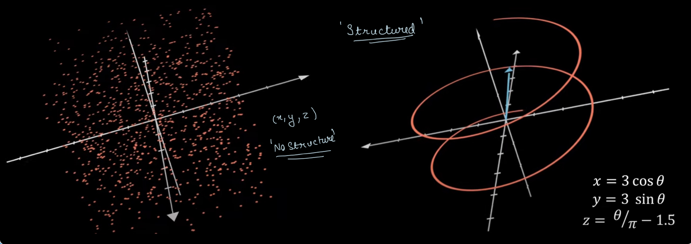
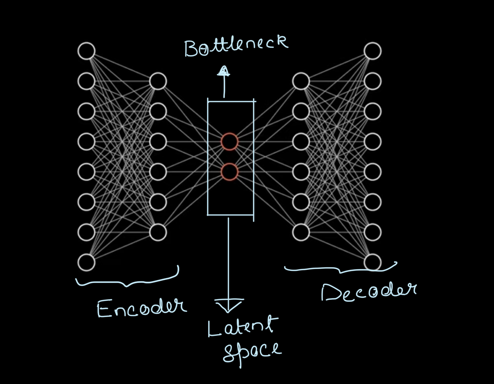
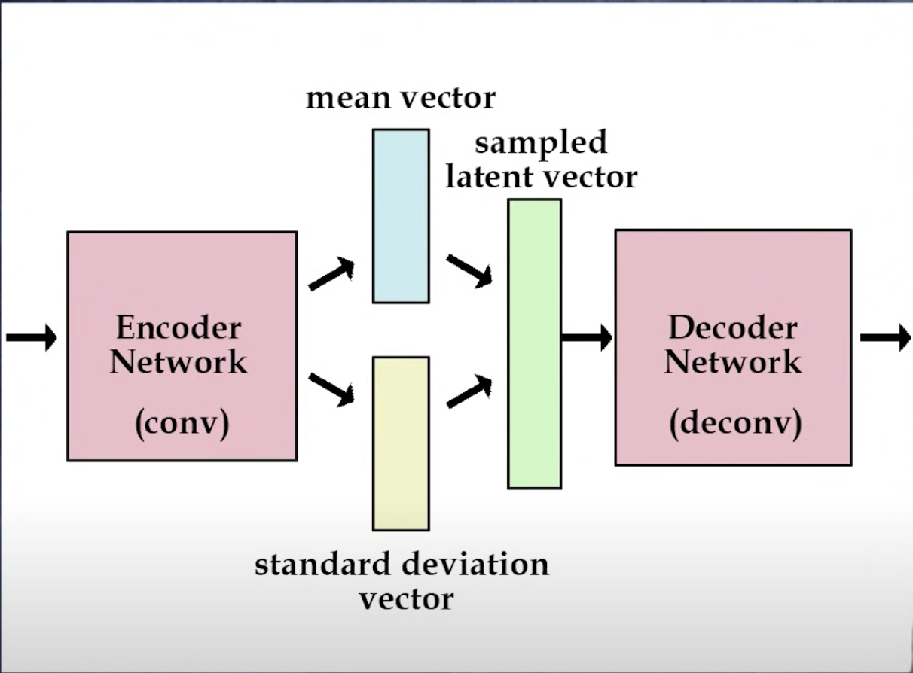
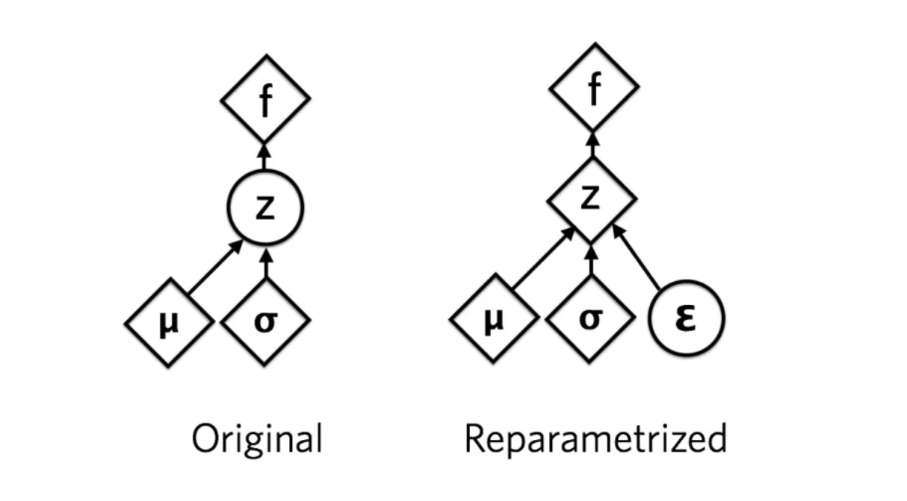

Over the years neuroscience has inspired many quantum leaps in Artificial Intelligence. One such remarkable development inspired by the visual ventral system of the brain is Disentangled Variational Autoencoders.

So first things first -

## What are  Autoencoders?

In a real-world scenario,  fewer dimensions may be required to capture the information stored in a particular data point than already present. This is due to the inherent structure of the data.

As shown above, in the first image data points are truly random, there is no structure to data so all three x, y, and z coordinates are necessary to represent data. While in the second image, data is restricted to a spiral, there is some structure to data so that it could be represented by just two variables.

Autoencoder uses neural networks to provide an unsupervised approach to deal with data.

 Data is run through a neural network and map it into a lower dimension called the latent dimension. Then that information can be decoded using a decoder. If we increase the dimensions of the latent space we would get a more detailed image but the number of dimensions required for a considerably clear reconstruction might be very less as compared to the original dimensionality .It could also be used for applications like image segmentation, denoising and neural inpainting.

### How does it work?

Basically we compress the information into latent variables using non linear activation function and then run it through the decoder with the aim of recreating the input data by using just the information stored in latent variables. We calculate the reconstruction loss by comparing the output with input then try to minimize this loss by changing the parameters.

## Variational Autoencoders

We have a rough idea of autoencoders by now, so the next question which is arises is what are Variatonal Autoencoders(VAEs) and how are they different ?

In VAEs unlike traditional autoencoders the input is mapped to a distribution from which data is sampled and fed into the decoder.

Given input data $x$ and latent variable $z$ , encoder tries to learn the posterior distribution $p(z|x)$.

This posterior is intractable so VAEs use variational inference to approximate it

> ***Variational Inference** : We choose a family of distribution and then fit it to the input data by changing the parameters. This helps us learn a good approximation to intractable distribution.*
> 

### But how do we know if we have a good approximation of the posterior ?

The metric we use to determine how close the approximated distribution is to the required posterior is the Kullback-Liebler Divergence.

$$
\hat{q}(z)=\underset{q\sim Q}{\operatorname{argmax}} KL(q(z)||p(z|x))

$$

Here q(z) is the approximated distribution and Q is the family of distributions of which q is a member.

One visible problem with this is that we dont know p(z|x), so we cant calculate KL divergence directly. To deal with this we convert this into optimization problem. We will skip the maths here and directly jump to the results.

$$
KL(q(z)||p(z|x))=-ELBO(q)+p(x)
$$

Here ELBO is the something called the Evidence Lower Bound. It is the only term dependent on q. So we have to just maximize ELBO to minimize KL divergence and subsequently find good approximation of the posterior distributaion.

### The Reparameterization trick:

If one pays close attention its difficult to not notice an obvious hurdle in this model. We cant run gradient through sampling operations. So how do we train this model ? This is where the Reparameterization trick comes to rescue!

We rewrite z as :      $z=\mu +\sigma \bigodot \epsilon$ . 

$\bigodot$ here represents the elementwise product of matrices or the Hadamard product

$\mu$ — Mean of the distribution

$\sigma$ —Standard Deviation

$\epsilon \sim N(0,1)$

This reparametrization splits the latent representation into deterministic and stochastic parts. Here $\mu$ and $\sigma$ are the deterministic quantities that  we train by using gradient descent, while $\epsilon$

represents the stochastic component, introducing randomness and preventing a direct one-to-one mapping of the data.

## What do we mean by ‘disentangling’?

Neural networks and the information stored in it is often treated a blackbox with no real way to map which artificial neuron contains what information. Infact there is an entire field of AI called Explainable AI (XAI) dedicated to deal with this problem. One significant reason why it's difficult to comprehend and map this information is that artificial neurons don't store information in an organized and compartmentalized form as we perceive it. It wouldn't be inaccurate to state that knowledge is rather "entangled.”

Disentangling refers to making sure that all neurons in latent space learn something different and uncorellated about training data. change in a single latent unit  It helps us to compartmentalise and organise information enabling crucial applications like knowledge transfer and zero-shot learning

> ***Knowledge Transfer** : It is using information learnt in one context to learn new things faster.*
> 

> ***Zero-shot learning :** It is the use of learnt information to draw inference about unseen data.*
> 

Ability to learn uncorrelated underlying factors in an un supervised setting has far reaching implications. It gives the model the ability to recombine the old information in a novel scenario and extrapolate it to make inference just like humans. It also causes model to learn about basic visual concepts like ‘objectness’. This is crucial in order to make machines that think like humans.

## How is disentangling executed ?

Disentangling is inspired by Visual Ventral System of Brain. We translate the biological constraints to mathematical constraints to apply similar pressures.

1. **Exposure to data with transform continuities :** Ventral visual system of infants learn from continously transforming data. Response properties of neurons in the inferior temporal cortex arise through a Hebbian learning algorithm that relies on the fact that nearest neighbours of a particular object in pixel space are the transforms of of the same object.
    
    
    

The image above clearly demonstrates that sparse data point do not provide enough information for an unsupervised model to identify where the data manifold should lie.

Thus it is important that the factors of variation of observed data are densely sampled from their respective distributions.

1. **Redundancy reduction and encouraging statiscal independence :** 

Deep unsupervised model is encouraged to perform redundancy reduction and learn statistically independent factors from continuous data in order to learn basic visual concepts similar to humans

> ***Redundancy** :Difference between maximum entropy a channel can transmit, and the entropy of messages actually transmitted.*
> 

Redundancy reduction is facilitated through learning statistically independent factors

This mathematically translates to the following constrained optimisation problem

$$
\mathcal{L}(\theta,\phi;x)= \mathbb{E}_{q_{\phi}(z|x)}[logp_{\theta}(x|z)] -\beta D_{KL}(q_{\phi}(z|x)||p(z))
$$

Here we need to maximize $\mathcal{L}(\theta,\phi;x)$ ;

where, $x$ is observed data ;$z \in \R^{n}$  are the latent factors; $\beta \ge 0$ is the inverse tempreature or regularisation coefficient

We generally set the disentangled prior to be isotropic gaussian i.e. $p(z)=\mathcal{N}(0,I)$

Redundancy reduction is enforced by constraining the capacity of latent information channel $z$ while preserving enough information to enable reconstruction.

Isotropic nature of Gaussian puts implicit independence pressure on the latent posterior.

Varying $\beta$ changes degree of applied learning pressure during training. 

$\beta$ =0 ⇒ Standard Maximum Likelihood Learning

$\beta$ =1 ⇒ Bayes Solution

### Example:

The above image shows difference in latent representations of disentangled and entangled learning on same dataset of 2D shapes.

In fig A i.e. disentangled learning with $\beta$ =4 ; latent factor z5, z7, z4, z9, z2 encode information about position in Y, position in X, scale, cos and sin rotational coordinates respectively. While orther latent factors learn uninformative Gaussian distribution.

Clearly in fig B i.e. the entangled case, there is no such seperation of factors and it is impossible to know what factor encodes what.

## Conclusion:

The development of Artificial General Intelligence(AGI) i.e. giving machines abililty to learn, think and reason out like humans has been a scientific fantasy for a long time now. Learning of basic visual concepts like objectness, ability to accelerate learning using prior knowledge and ability to infer in a unseen scenario by combining past knowledge are essential qualities for realisation of this goal. Development of unsupervised learning models like disentangled VAEs is a key step in this direction. Its application in Reinforcement learning scenarios is also very promising.

## References :

1. [Disentangled VAE's (DeepMind 2016)](https://arxiv.org/abs/1606.05579)
2. [Original VAE paper (2013)](https://arxiv.org/abs/1312.6114)